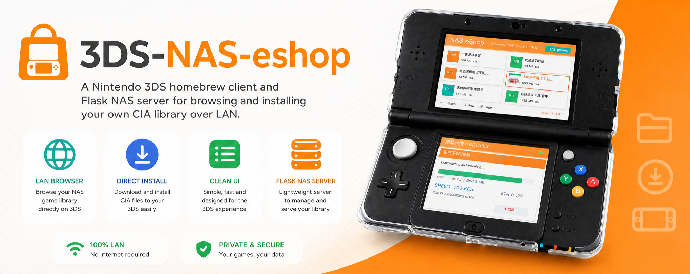
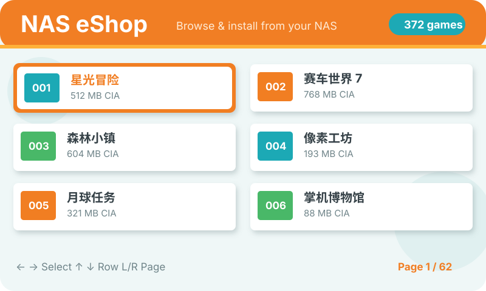
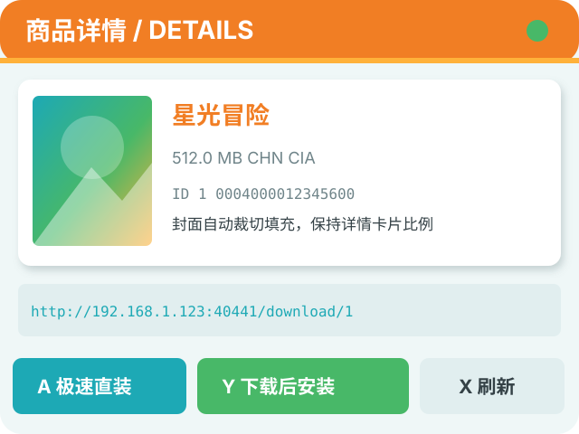
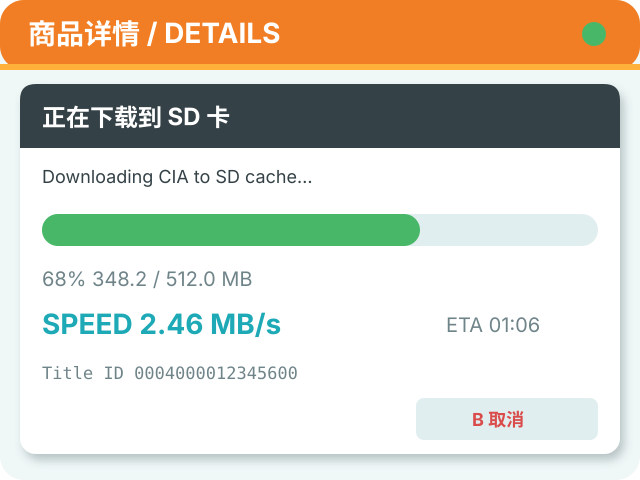

<p align="center">
  <strong>English</strong> |
  <a href="README.zh-CN.md">简体中文</a>
</p>

<p align="center">
  
</p>

# 3DS NAS eShop

> Browse your personal NAS game library on a Nintendo 3DS, view cover art,
> and install CIA files directly to the SD card.

3DS NAS eShop consists of two parts:

- A Flask service for Synology or any standard Linux NAS. It scans files,
  manages metadata and cover art, and serves downloads over your LAN.
- A libctru/citro2d `.3dsx` client with an eShop-inspired dual-screen UI,
  Unicode game titles, cover art, and detailed installation progress.

This project does not include games, Title Keys, system files, or any
Nintendo copyrighted content. Only use content you legally own and have
backed up yourself.

## Design previews

> The following images illustrate the current UI colors and structure; they
> are not photos of a real console. They use fictional titles and example
> addresses. Font rendering, sizes, and spacing may differ slightly on real
> hardware.

<p align="center">
  
</p>

<p align="center">
  
  
</p>

## Features

- Browse hundreds of `.cia`, `.3ds`, and `.3dsx` files.
- Parse JSON `\uXXXX`, UTF-16 surrogate pairs, and `null` values.
- Display Unicode titles, cover art, file size, region, and Title ID.
- `A` fast direct install: pipelined NAS download and AM installation with
  double buffering.
- `Y` staged install: download to SD first, resume interrupted downloads, and
  automatically remove the cache after a successful installation.
- Validate CIA Title IDs before installation, allow only SD user-content
  categories, and reject system titles.
- Show progress, real-time speed, ETA, Title ID, and remaining storage.
- Manage scans, names, cover uploads, and downloads from the web interface.
- Optionally match missing cover art with the K73 helper script.

## Repository layout

```text
3ds-nas-eshop/
├── include/                 3DS client headers
├── source/                  3DS client source
├── tests/                   JSON and CIA safety tests
├── server/
│   ├── nas_server.py        NAS Flask service
│   ├── requirements.txt     Python dependencies
│   └── env.example          Environment variable example
├── scripts/                 Optional cover-matching helper
├── docs/
│   ├── SYNOLOGY.md          Step-by-step Synology guide
│   ├── CLIENT.md            Build, copy, and use the client
│   └── TROUBLESHOOTING.md   Common problems
└── Makefile
```

## Quick start

### 1. Deploy the NAS service

Recommended layout on Synology:

```text
/volume1/homes/<DSM_USER>/3ds-nas-eshop/
├── server/nas_server.py
├── server/requirements.txt
└── data/
    ├── db/games.db
    └── covers/

/volume2/myfile/3dsrom/
├── Game A.cia
├── Game B/
│   └── Game B [0004000012345600].cia
└── static/
    └── 3ds-eshop-client.3dsx
```

The service reads these locations from environment variables, so the volume
numbers do not need to match the example:

```sh
export ESHOP_GAMES_DIR="/volume2/myfile/3dsrom"
export ESHOP_DATA_DIR="/volume1/homes/<DSM_USER>/3ds-nas-eshop/data"
export ESHOP_PORT="40441"
python3 server/nas_server.py
```

Open the management page:

```text
http://<NAS_IP>:40441/
```

Select **Scan for new games**, or visit:

```text
http://<NAS_IP>:40441/api/scan
```

For directory creation, copying files from macOS, Python dependencies,
background startup, and DSM Task Scheduler configuration, see the
[Synology deployment guide](docs/SYNOLOGY.md) (currently in Chinese).

### 2. Build the 3DS client

The `.3dsx` build requires devkitARM, libctru, citro2d, and citro3d.
Creating a HOME Menu package also requires `makerom` and `bannertool`:

```sh
export DEVKITPRO=/opt/devkitpro
export DEVKITARM="$DEVKITPRO/devkitARM"
export PATH="$DEVKITPRO/tools/bin:$DEVKITARM/bin:$PATH"

make release NAS_HOST=192.168.1.123 NAS_PORT=40441 -j4
```

Replace `192.168.1.123` with the fixed LAN address of your NAS. The build
produces:

```text
3ds-eshop-client.3dsx
3ds-eshop-client.smdh
3ds-eshop-client.cia
```

See [building and installing the client](docs/CLIENT.md) for the complete
guide (currently in Chinese).

### 3. Install to the 3DS HOME Menu (recommended)

Download `3ds-eshop-client.cia` from the
[latest release](https://github.com/Ecparterhacs/3ds-nas-eshop/releases/latest),
copy it to the SD card, and install it with FBI. Alternatively, place the CIA
in the NAS `static/` directory and use the following option in FBI:

```text
Remote Install → Install from URL
http://<NAS_IP>:40441/static/3ds-eshop-client.cia
```

After installation, exit FBI. The orange shopping-bag icon will appear on the
HOME Menu and launches the client directly, without Homebrew Launcher. The
application uses the stable Title ID `000400000E5A1000`, so future releases
can be installed as upgrades.

### 4. Use the Homebrew Launcher build

The recommended method is to power off the console, remove the SD card, and
create:

```text
SD:/3ds/3ds-nas-eshop/
```

Copy and rename the files to:

```text
SD:/3ds/3ds-nas-eshop/3ds-nas-eshop.3dsx
SD:/3ds/3ds-nas-eshop/3ds-nas-eshop.smdh
```

Return the SD card to the console and launch the app from Homebrew Launcher.

## Controls

| Button | Action |
| --- | --- |
| D-pad | Select a game |
| `L` / `R` | Change page |
| `A` | Fast direct install; press `A` again to confirm |
| `Y` | Download to SD, then install; press `A` again to confirm |
| `B` | Cancel installation or exit |
| `X` | Reload the NAS game list |
| `SELECT` | Toggle real-hardware diagnostics |
| `START` | Exit the client |

Staged-install cache paths:

```text
SD:/3ds/nas-eshop/cache/game_<database-ID>.cia.part
SD:/3ds/nas-eshop/cache/game_<database-ID>.cia
```

- An interrupted download keeps the `.cia.part` file and attempts to resume
  the next time you select the same game.
- If downloading finishes but installation fails, the `.cia` file is kept so
  installation can be retried without downloading it again.
- After AM confirms a successful installation, the `.cia` cache is removed.
- Staged installation requires approximately twice the CIA file size in free
  storage.

## Cover art

Use the web interface to upload cover art for an individual game or provide
an image URL. You can also run:

```sh
ESHOP_NAS=http://127.0.0.1:40441 \
  python3 scripts/k73_auto_covers.py --dry-run

ESHOP_NAS=http://127.0.0.1:40441 \
  python3 scripts/k73_auto_covers.py
```

The script only updates games without cover art. Third-party page structures
may change at any time; follow the source website's terms of use and rate
limits. Generated crawl caches and match reports are not committed.

## Tests

```sh
make test
```

The tests use synthetic CIA headers and neither require nor read real games.

## Security

- The Flask API currently has no authentication. Run it only on a trusted LAN.
- Do not expose port `40441` to the Internet.
- Give the NAS a fixed DHCP lease and restrict access to the LAN in your
  firewall.
- `/api/rescan` rebuilds the metadata database but does not delete game files.
- Direct installation is a privileged operation. Do not power off the console
  or remove the SD card during installation.

## License

The code is licensed under the [MIT License](LICENSE). Nintendo, Nintendo 3DS,
FBI, and all other names belong to their respective owners. This project is
not affiliated with Nintendo.
